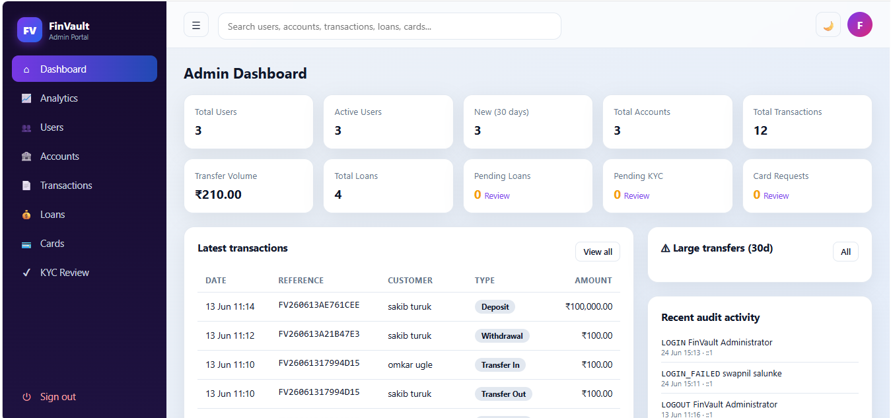

# 💰 FinVault · Modern Digital Banking Platform

## 📘 Project Overview

FinVault is an educational digital banking simulation platform built using PHP 8+, MySQL, and vanilla JavaScript.

It replicates real-world banking workflows such as authentication, transactions, loans, cards, KYC, and notifications — all running on a secure database-driven simulation layer.

No real money, no external banking APIs — everything is internally simulated for learning, system design practice, and portfolio demonstration.




For the complete user interface and all application modules, visit the **[screenshots](finvault/screenshots/)** directory.

---

## 🧩 System Architecture

The platform is divided into two core layers:

🌐 **Web Portal (PHP + MySQL + JavaScript)**  
Customer and Admin dashboards, banking operations, reports, and management tools.

⚙️ **Backend Engine (PHP Core + Service Layer)**  
Authentication, transaction processing, notification system, audit logging, email service, and PDF generation.

---

## 🚀 Core Features

### 🔐 Authentication System
- Email OTP-based registration (5-minute expiry, hashed OTP storage)
- Secure login with account lockout after failed attempts
- Login activity tracking (IP, time, device metadata)
- Forgot password with OTP verification flow
- Password reset success notification email
- Password change confirmation email
- Session timeout with auto logout
- CSRF protection across all forms and AJAX requests
- Secure password hashing using `password_hash()`

---

### 🧑‍💼 Customer Portal
- Dashboard with balance overview and analytics cards
- Fund transfer system (review → confirm → receipt)
- Beneficiary management with AJAX autocomplete search
- Transaction history with filters and pagination
- PDF bank statement generation (TCPDF / HTML fallback)
- Loan module with live EMI calculator
- Debit/Credit card management (simulated lifecycle)
- KYC document upload system
- QR payment simulation
- Notification center (email + in-app)
- Profile management and password update
- Smart global search with live AJAX suggestions

---

### 🛠️ Admin Portal
- KPI dashboard with real-time analytics
- User management (search, edit, suspend, delete, reset password)
- Account control (create, freeze, adjust balance)
- Transaction monitoring with fraud/large-transfer detection
- Loan & card approval workflows
- KYC verification queue
- Advanced analytics dashboard using Chart.js
- System audit logs (database + file logging)

---

## 🔔 Notification System (Event Driven)

Centralized event-based notification engine.

### ✉️ Emails & Alerts
- Registration OTP email
- Welcome email after OTP verification
- Login alert email (IP + device tracking)
- Credit transaction alert email
- Password reset email
- Password reset success email
- Password change confirmation email

### ⚙️ Design
- Central `notifications` table as event registry
- Trigger-based notifications from auth and transaction modules
- Metadata support (IP, device, transaction ID, amount, etc.)
- Status tracking: pending → sent → failed

---

## 💰 Transaction Engine
- Credit and debit ledger system
- Automatic balance updates
- Unique transaction reference ID generation
- Full audit trail for every transaction
- Event-triggered credit notifications

---

## 🧰 Platform Features
- Smart global search (AJAX-based)
- Audit logging (database + file backup)
- Email system using PHPMailer (with fallback logging)
- PDF generation using TCPDF (HTML fallback supported)
- Modern UI with glassmorphism design
- Dark / light mode support
- Toast notifications, loaders, skeleton screens
- Fully responsive design (mobile + desktop)

---

## 🛠️ Tech Stack
PHP 8+ · MySQL 8 · HTML5 · CSS3 · Vanilla JS · AJAX · Chart.js · qrcodejs · PHPMailer · TCPDF

---

## ⚙️ Installation Guide

### Requirements
- PHP 8.0+
- MySQL 8+
- Apache / XAMPP / WAMP / LAMP

---

### Setup Steps

1. Clone project into web root:

htdocs/finvault


2. Import database:

database/finvault.sql


3. Configure system in:

includes/config.php


Set:
- Database credentials
- BASE_URL → http://localhost/finvault
- SMTP settings (optional)

---

### Admin Login

Default credentials:

Email: sakib1@gmail.com
Password: password


OR generate:

php database/seed_admin.php


Default password:

password


---

## 📧 Email System Configuration (IMPORTANT)

FinVault uses PHPMailer with Gmail SMTP.

### Config in includes/config.php
```php
const DEV_SHOW_OTP   = false;
const SMTP_ENABLED   = true;

const SMTP_HOST      = 'smtp.gmail.com';
const SMTP_PORT      = 587;

const SMTP_USER      = 'your_email@gmail.com';
const SMTP_PASS      = 'app_password';

const SMTP_FROM      = 'your_email@gmail.com';
const SMTP_FROM_NAME = 'FinVault Banking';
Gmail Setup
Enable 2-Step Verification
Generate App Password
Use it in SMTP_PASS
If SMTP not configured
Emails stored in:
logs/mail.log
System continues normally
📦 Optional Libraries

PHPMailer:

composer require phpmailer/phpmailer

or manual:

assets/vendors/phpmailer/

TCPDF:

composer require tecnickcom/tcpdf

or:

assets/vendors/tcpdf/

Fallback: HTML printable output

🔐 Security Model
PDO prepared statements
bcrypt password hashing
CSRF protection
Session timeout + regeneration
Login throttling
Secure file uploads
Protected directories
Full audit logging

📁 Project Structure
admin/      Admin dashboard
customer/   Customer banking portal
api/        AJAX backend services
includes/   Core system logic
database/   SQL schema
assets/     UI + JS + CSS + libraries
uploads/    User documents
reports/    Generated PDFs
logs/       system + mail logs
⚠️ Disclaimer

FinVault is an educational simulation project only.
No real money transactions or banking integrations exist.
